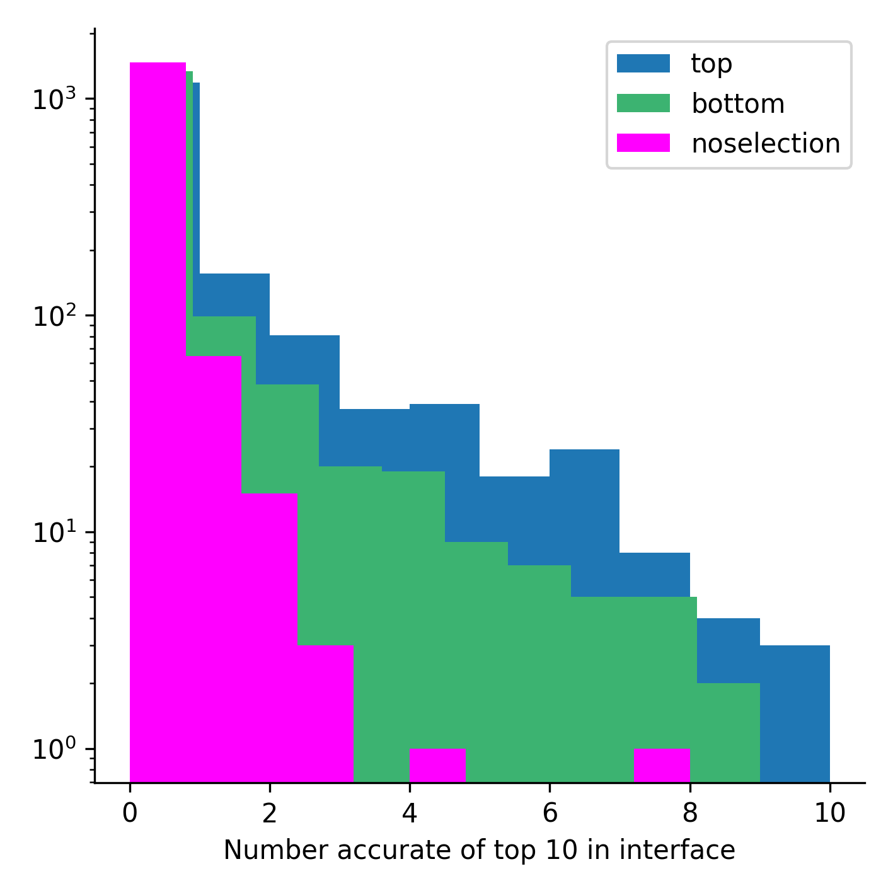

# OXMatch
A simple script for matching sequences from two different MSAs based on the OX identifiers resulting from an hhblits search.
The top hits from each MSA and OX will be selected since these are currently the most likely ortholog selections

Input: MSAs to be matched in a3m format

Output: Merged MSA i a3m format

Requirements: python3 and numpy (v.1.16.6 or higher)

Run like this:

A3M1=./test/1KA9_F.a3m #Path to a3m1

A3M2=./test/1KA9_H.a3m #Path to a3m2

MGF=0.9 #Max gap fraction allowed in each sequence

OUTDIR=./test/ #Output directory

python3 oxmatch.py --a3m1 $A3M1 --a3m2 $A3M2 --max_gap_fraction $MGF --outdir $OUTDIR

## Statistics of matching
Comparison of the results from matching the top and bottom hits for each OX from an hhblits search with no pairing (noselection). The dataset used for the comparison consists of around 1600 protein-protein interactions and can be found here: https://www.nature.com/articles/s41467-021-21636-z

